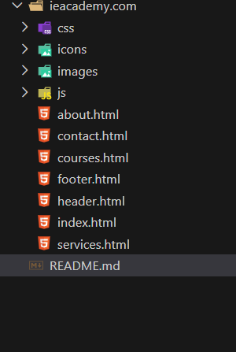

1. Project Title

Corporate Website named: International English Academy (IEA)

2. Description

A responsive personal portfolio website built with HTML5 and CSS3 and JavaScript.
It showcases services, courses options, About and services, for the International English Academy School.

3. Features

• Responsive design (mobile, tablet & desktop friendly)
• Accessible with proper semantic HTML and ARIA labels
• Sticky navigation bar and hamburger menu
• Custom branding and styling

4. Folder structure

5. Technologies Used

- HTML5
- Modern CSS3 (Flexbox, Grid, Media Queries)
- Form Handling API from "Web3Forms" (https://docs.web3forms.com)

-  Palette Color:

:root {
  --primary-color: #d3aa60;
  --secondary-color: #4b7679;
  --tertiary-color: #5b7c7f;
  --hover-color: #445767;
  --text-primary: rgb(31, 24, 24);
  --text-secondary: #ffff;
  --text-body: grey;
  --pages-sections-bg-color:  rgb(242, 238, 238);
}

6. Accessibility & Best Practices

This site follows accessibility best practices:

- Semantic HTML tags
- Proper alt attributes for images
- Language attribute set to `en-GB`

7. Deployment

Live Demo : https://armel-nzawou-developer.github.io/International-English-Academy/

8. License

- This project is not an open source but private propeerty of IEA.
- This project is licensed under IEA's brand.
